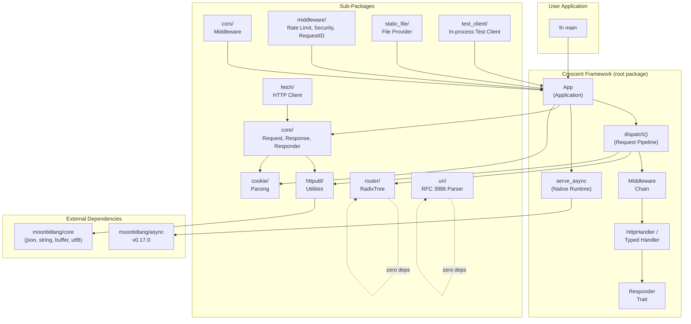
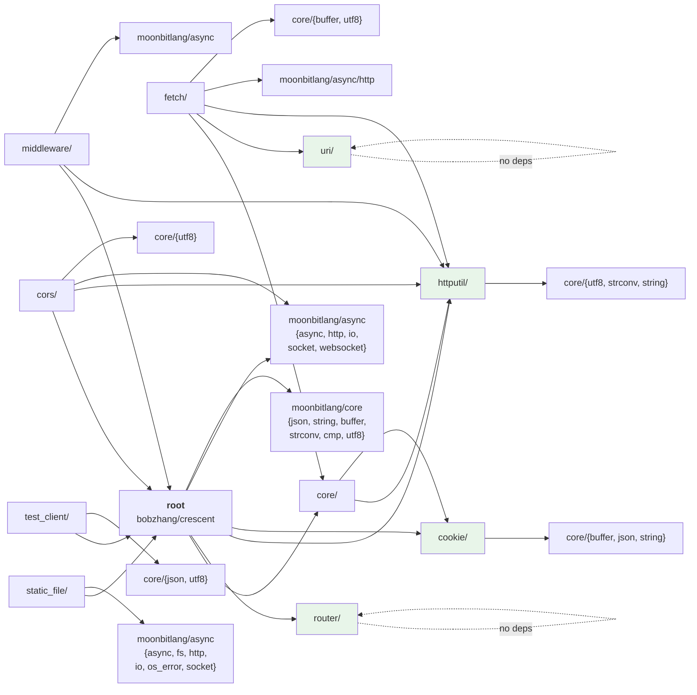
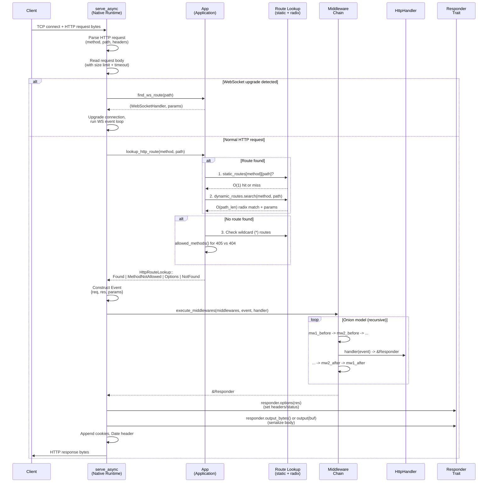
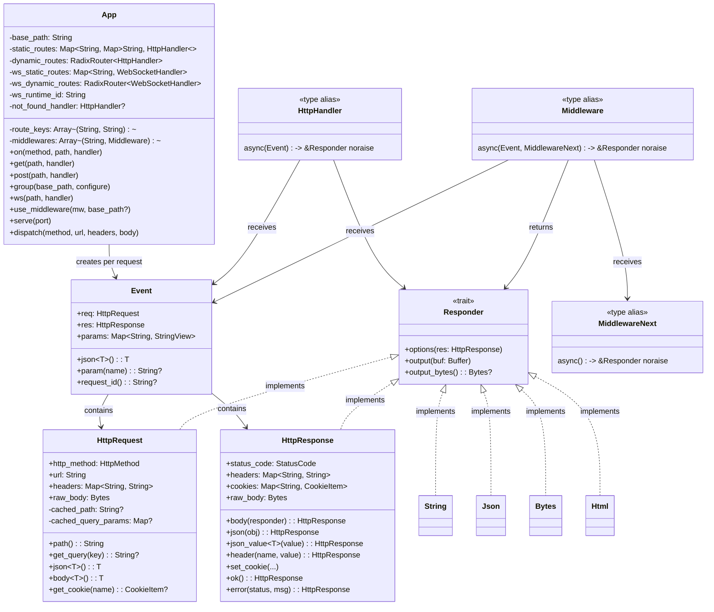
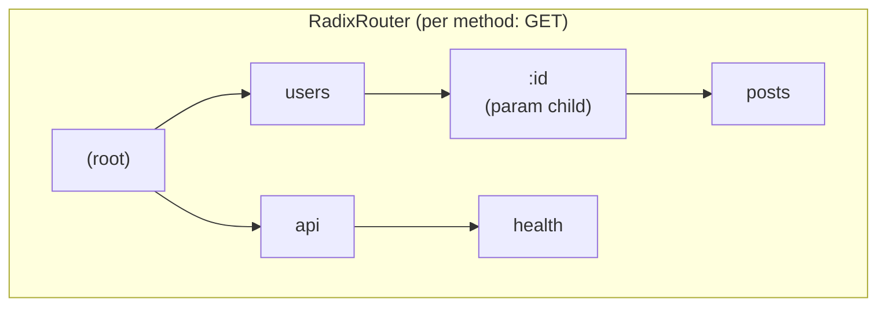
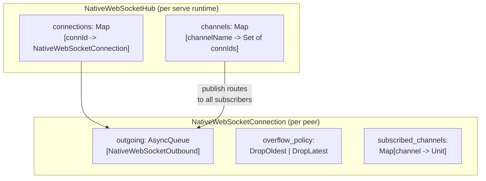
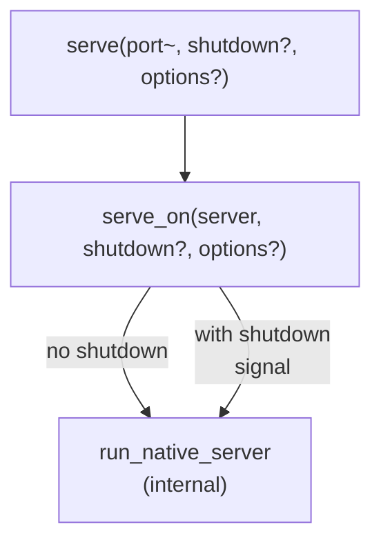

# Crescent Architecture Guide

> **Crescent** (`bobzhang/crescent`) is a native-first, type-safe, async HTTP and
> WebSocket server framework for [MoonBit](https://docs.moonbitlang.com). Version
> 0.10.1. Apache-2.0 licensed.

This document explains the architecture of the Crescent codebase from the ground
up. It assumes you are a strong programmer but does not assume familiarity with
web programming. Every web concept is introduced before it is used.

---

## Table of Contents

1. [Web Programming in 5 Minutes](#1-web-programming-in-5-minutes)
2. [What Crescent Does](#2-what-crescent-does)
3. [High-Level Architecture](#3-high-level-architecture)
4. [Package Dependency Graph](#4-package-dependency-graph)
5. [The Life of a Request](#5-the-life-of-a-request)
6. [Core Type Map](#6-core-type-map)
7. [The App Type (`index.mbt`)](#7-the-app-type)
8. [Routing: Mapping URLs to Code (`router/`)](#8-routing-mapping-urls-to-code)
9. [Middleware: Cross-Cutting Concerns (`middleware.mbt`)](#9-middleware-cross-cutting-concerns)
10. [Responder: Polymorphic Responses (`responder.mbt`)](#10-responder-polymorphic-responses)
11. [Typed Handlers and Error Mapping (`typed_handler.mbt`)](#11-typed-handlers-and-error-mapping)
12. [HTTP Utilities (`httputil/`)](#12-http-utilities)
13. [WebSocket: Persistent Bidirectional Channels](#13-websocket-persistent-bidirectional-channels)
14. [Native Server Runtime (`serve_async.mbt`)](#14-native-server-runtime)
15. [Sub-Packages](#15-sub-packages)
16. [Testing Infrastructure](#16-testing-infrastructure)
17. [Codebase Statistics](#17-codebase-statistics)

---

## 1. Web Programming in 5 Minutes

If you already know HTTP, skip to [Section 2](#2-what-crescent-does). This
section introduces the domain vocabulary that the rest of the document uses.

### HTTP: A Request-Response Text Protocol

HTTP (HyperText Transfer Protocol) is how browsers talk to servers. It is a
**stateless, text-based, request-response protocol** over TCP. A client sends a
request; the server sends back exactly one response. Then they are done (or reuse
the connection for the next request).

A request looks like this on the wire:

```
GET /users/42?fields=name HTTP/1.1     <- request line: METHOD PATH?QUERY VERSION
Host: example.com                      <- headers: key-value metadata
Accept: application/json               <- (one per line)
Cookie: session=abc123                 <- (the browser attaches cookies automatically)
                                       <- empty line = end of headers
                                       <- (body follows for POST/PUT, empty for GET)
```

A response looks like this:

```
HTTP/1.1 200 OK                        <- status line: VERSION STATUS_CODE REASON
Content-Type: application/json         <- headers
Set-Cookie: session=xyz789             <- (tells the browser to store a cookie)
                                       <- empty line
{"id": 42, "name": "Alice"}           <- body (the actual data)
```

### Key Concepts

**Method** -- The verb describing what the client wants to do. The important ones:

| Method   | Meaning                | Has body? | Idempotent? |
|----------|------------------------|-----------|-------------|
| `GET`    | Read a resource        | No        | Yes         |
| `POST`   | Create a resource      | Yes       | No          |
| `PUT`    | Replace a resource     | Yes       | Yes         |
| `PATCH`  | Partially update       | Yes       | No          |
| `DELETE` | Delete a resource      | No        | Yes         |
| `HEAD`   | Like GET but no body   | No        | Yes         |
| `OPTIONS`| Ask "what methods are allowed here?" | No | Yes |

"Idempotent" means calling it twice has the same effect as calling it once.
`POST` is not idempotent: posting twice creates two resources.

**URL path** -- The `/users/42` part identifies *which* resource. A web framework
maps paths to handler functions. This mapping is called **routing**.

**Query string** -- The `?fields=name` part after the path. Key-value pairs for
optional parameters. Separated by `&` (e.g., `?page=2&limit=10`). Special
characters are **percent-encoded**: a space becomes `%20`, `&` becomes `%26`.

**Headers** -- Key-value metadata attached to both requests and responses. HTTP
says header names are **case-insensitive** (`Content-Type` = `content-type` =
`CONTENT-TYPE`). Important headers:

| Header          | Direction | Purpose                                    |
|-----------------|-----------|--------------------------------------------|
| `Content-Type`  | Both      | Describes the body format (MIME type). E.g., `text/html`, `application/json`, `application/octet-stream` |
| `Content-Length` | Both     | Body size in bytes                         |
| `Cookie`        | Request   | Browser sends stored cookies back          |
| `Set-Cookie`    | Response  | Server tells browser to store a cookie     |
| `Authorization` | Request   | Credentials (e.g., API key, token)         |
| `Date`          | Response  | When the server generated the response     |
| `ETag`          | Response  | A fingerprint of the resource's current version. If the client sends `If-None-Match: <etag>` and the resource hasn't changed, the server can reply with `304 Not Modified` and no body, saving bandwidth. |

**Status code** -- A three-digit number in the response indicating what happened.
The first digit defines the category:

| Range   | Category       | Examples                                      |
|---------|----------------|-----------------------------------------------|
| `1xx`   | Informational  | `101 Switching Protocols` (used for WebSocket) |
| `2xx`   | Success        | `200 OK`, `201 Created`, `204 No Content`     |
| `3xx`   | Redirect       | `301 Moved Permanently`, `307 Temporary Redirect` |
| `4xx`   | Client error   | `400 Bad Request`, `404 Not Found`, `405 Method Not Allowed`, `413 Request Entity Too Large`, `429 Too Many Requests` |
| `5xx`   | Server error   | `500 Internal Server Error`, `504 Gateway Timeout` |

A `404` means "that URL doesn't exist." A `405` means "that URL exists, but not
for the method you used" (e.g., you sent DELETE to a read-only endpoint). A `500`
means "the server crashed while handling your request."

**Cookies** -- Small key-value strings the server asks the browser to store.
The browser sends them back on every subsequent request to the same domain. This
is how servers implement sessions and login persistence in a stateless protocol.
Cookies have attributes: `Max-Age` (expiry), `Path` (scope), `Secure` (HTTPS
only), `HttpOnly` (not accessible from JavaScript), `SameSite` (cross-site
restriction).

**CORS (Cross-Origin Resource Sharing)** -- Browsers enforce a **same-origin
policy**: JavaScript on `site-a.com` cannot make requests to `site-b.com` unless
`site-b.com` explicitly allows it. CORS is the mechanism for granting that
permission. Before making a "dangerous" cross-origin request (e.g., POST with a
JSON body), the browser sends a **preflight request**: an `OPTIONS` request with
`Origin` and `Access-Control-Request-Method` headers. The server must respond
with headers like `Access-Control-Allow-Origin: site-a.com` to permit the real
request. Without CORS headers, the browser blocks the response. This is purely a
browser security feature -- non-browser HTTP clients (curl, Postman, your own
code) ignore CORS entirely.

**WebSocket** -- HTTP is request-response: the client always initiates. WebSocket
is a different protocol that starts as an HTTP request (the **upgrade
handshake**, status `101 Switching Protocols`) and then converts the TCP
connection into a **persistent, bidirectional message channel**. Either side can
send messages at any time. This is used for real-time features like chat, live
updates, and multiplayer games. The server does not need to wait for the client to
ask.

**Static files** -- Serving files (HTML, CSS, JS, images) directly from the
filesystem. The server reads the file, guesses the `Content-Type` from the file
extension (`.html` -> `text/html`, `.png` -> `image/png`), and sends it. An
**ETag** (entity tag) is a hash or timestamp fingerprint so the browser can cache
the file and ask "has this changed?" on the next request.

**Multipart form data** -- When an HTML form uploads a file, the browser encodes
the body as `multipart/form-data`: a sequence of parts separated by a random
boundary string, where each part has its own headers (filename, content-type) and
body. This is more complex to parse than JSON or URL-encoded forms.

### What a Web Framework Does

Without a framework, you would:
1. Open a TCP socket, listen for connections.
2. Read raw bytes, parse the HTTP request text yourself.
3. Look at the method and path, branch to the right handler function.
4. Serialize your response (set status, headers, body) as HTTP text.
5. Write bytes back to the socket.
6. Handle errors, timeouts, keep-alive, concurrent connections, etc.

A web framework automates all of this. You write **handler functions** that
receive a parsed request and return a response. The framework handles parsing,
routing, serialization, concurrency, and protocol details. Crescent is such a
framework.

---

## 2. What Crescent Does

Crescent lets you write a web server in MoonBit like this:

```moonbit
async fn main {
  let app = @crescent.App()
  app.get("/hello/:name", event => {
    let name = event.param("name").unwrap_or("World")
    "Hello, \{name}!"
  })
  app.serve(port=4000)
}
```

When a browser visits `http://localhost:4000/hello/Alice`, the handler runs and
the browser sees `Hello, Alice!`. The framework handles everything else: TCP
accept, HTTP parsing, routing `/hello/Alice` to the handler, extracting `Alice`
as the `:name` parameter, setting `Content-Type: text/plain`, writing the
response bytes, and managing concurrent connections.

The framework is built on `moonbitlang/async`, MoonBit's cooperative async
runtime, which provides non-blocking TCP sockets and timers. Crescent targets the
**native** backend exclusively (not WASM/JS) because it directly uses native
system calls for I/O.

---

## 3. High-Level Architecture

Crescent is a MoonBit module with a root package and ten sub-packages.



**Key design decisions:**

- **Two-tier routing**: Static paths (like `/users`) get O(1) `Map` lookup.
  Dynamic paths (like `/users/:id`) get O(path-length) radix tree lookup. Most
  real-world routes are static, so this avoids paying the tree traversal cost in
  the common case.
- **Onion-model middleware**: Middleware wraps handlers like function composition.
  Each middleware runs code before *and* after the handler, giving it access to
  both the incoming request and the outgoing response. This is explained in
  detail in [Section 9](#9-middleware-cross-cutting-concerns).
- **Trait-based response**: Handlers can return any type that implements the
  `Responder` trait -- `String`, `Json`, `Bytes`, `HttpResponse`, etc. The
  framework serializes the return value and sets the appropriate `Content-Type`
  header automatically. This is similar to how Rust's Axum or Actix let you
  return different types from handlers.
- **Typed vs Raw handlers**: `app.get(path, handler)` wraps the handler so that
  if it raises an error, the error is automatically converted to an HTTP error
  response (e.g., a JSON parse failure becomes a `400 Bad Request`).
  `app.get_raw(path, handler)` requires a `noraise` handler with no wrapping.

---

## 4. Package Dependency Graph

Arrows point from dependent to dependency. Leaf packages (`router/`, `uri/`)
have zero dependencies at all; `cookie/` depends only on `moonbitlang/core`
modules. All three have no internal (crescent) dependencies, making them
independently testable. `core/` (request, response, responder types) sits
under the root and is reused by `fetch/`, decoupling the HTTP client.



**External dependencies** (from `moon.mod.json`):

| Dependency          | Version | Purpose                                  |
|---------------------|---------|------------------------------------------|
| `moonbitlang/x`     | 0.4.41  | Extended standard library utilities      |
| `moonbitlang/async`  | 0.17.0  | Cooperative async runtime, TCP, HTTP/WS  |

---

## 5. The Life of a Request

This is the complete path of an HTTP request from TCP accept to response write.
Understanding this flow is essential for reasoning about where behavior lives.



### Route Lookup Precedence

When a request arrives, the framework must decide which handler to call. The
`lookup_http_route` function (`serve_async.mbt:353`) checks in this
order:

1. **Exact method + path** via `find_route()` -- first the static map (O(1)),
   then the radix tree (O(path_len)), then a catch-all `*` method.
2. **HEAD fallback** -- The HTTP spec says HEAD should behave like GET but return
   no body. If no explicit HEAD handler exists, the GET handler is used.
3. **405 Method Not Allowed** -- The URL exists under other methods (e.g., GET
   exists but the client sent DELETE). Returns 405 with an `Allow` header listing
   which methods *are* supported.
4. **Implicit OPTIONS** -- If the URL exists and the client sent OPTIONS, return
   200 with `Allow` header. This supports CORS preflight (see
   [Section 1](#key-concepts)).
5. **404 Not Found** -- No route matched. Uses the custom handler if registered,
   otherwise a default "Not Found" response.

---

## 6. Core Type Map

These are the types you will encounter constantly when reading the framework. If
you understand how they connect, you understand the framework.



**Reading the diagram:**

- `App` is the application container. It stores routes and middleware.
- For each incoming request, App creates an `Event` containing the parsed
  `HttpRequest`, a blank `HttpResponse`, and the extracted route `params`.
- An `HttpHandler` is a function that receives this event and returns something
  implementing the `Responder` trait. It does not directly return HTTP bytes --
  the trait handles serialization.
- A `Middleware` is a function that receives the event *and* a `next` continuation
  (the rest of the pipeline). It can inspect the request, call `next()`, then
  inspect the response.

---

## 7. The App Type

**File:** `index.mbt` (258 lines)

`App` is the central orchestrator. Think of it as a routing table combined
with a middleware stack. Its internal state is split by access pattern for
performance:

| Field               | Type                                          | Purpose                                      |
|---------------------|-----------------------------------------------|----------------------------------------------|
| `static_routes`     | `Map[method, Map[path, HttpHandler]]`         | O(1) lookup for fixed paths like `/users`    |
| `dynamic_routes`    | `RadixRouter[HttpHandler]`                    | O(path_len) lookup for paths with parameters like `/users/:id` |
| `ws_static_routes`  | `Map[path, WebSocketHandler]`                 | O(1) WebSocket path lookup                   |
| `ws_dynamic_routes` | `RadixRouter[WebSocketHandler]`               | O(path_len) WebSocket path lookup            |
| `middlewares`       | `Array[(base_path, Middleware)]`              | Ordered middleware list with optional path scoping |
| `route_keys`        | `Array[(method, path)]`                       | Flat list for introspection (e.g., printing all routes at startup) |
| `ws_runtime_id`     | `String`                                      | Unique ID scoping the WebSocket hub for this app instance |
| `not_found_handler` | `HttpHandler?`                                | Custom handler for URLs that don't match any route |

### Why Two Data Structures for Routes?

Most routes in a real application are **static** -- `/users`, `/login`,
`/health`. They have no variable parts. A `Map` lookup for these is O(1).

But some routes have **parameters** -- `/users/:id`, `/files/**`. These need
pattern matching. Crescent uses a **radix tree** for these (explained in
[Section 8](#8-routing-mapping-urls-to-code)).

By splitting routes into two structures, static routes never pay the cost of tree
traversal, and dynamic routes never clutter the static map. At lookup time, the
static map is checked first; only on a miss does the radix tree get consulted.

### Route Registration

When `app.on("GET", "/users/:id", handler)` is called (`index.mbt:57`):

1. The path is prepended with `base_path` (for groups, see below).
2. If the path contains `:` or `*`, it is **compiled** into a `CompiledRoute`
   and inserted into the `RadixRouter`. Otherwise, it goes into the
   `static_routes` map.
3. The `(method, path)` pair is always appended to `route_keys`.

### Route Groups

Route groups let you factor out a common path prefix and shared middleware.
`app.group("/api", configure)` (`index.mbt:185`) creates a child `App`
with `base_path = parent.base_path + "/api"`, calls the configure function,
then **merges** all of the child's state (routes, middleware, WebSocket routes,
not-found handler) back into the parent:

```moonbit
app.group("/api", group => {
  group.use_middleware(auth_middleware())  // only applies under /api
  group.get("/users", list_users)         // registers GET /api/users
  group.get("/users/:id", get_user)       // registers GET /api/users/:id
})
```

This is purely a compile-time organizational tool -- after the group's configure
function runs, everything is flattened into the parent's data structures.

---

## 8. Routing: Mapping URLs to Code

**Directory:** `router/`
**Files:** `route_pattern.mbt` (159 lines), `radix_tree.mbt` (376 lines)
**Dependencies:** None (leaf package -- no imports at all)

Routing is the process of taking a URL path like `/users/42/posts` and finding
the handler function that should run. This section explains how Crescent does it.

### Route Patterns

When you write `app.get("/users/:id/posts/**", handler)`, the path
`/users/:id/posts/**` is a **route pattern**. It contains four types of segments:

| Segment     | Syntax | Behavior                                 | Example match       | Captured as         |
|-------------|--------|------------------------------------------|---------------------|---------------------|
| `Static`    | `api`  | Exact string match. Most segments are this. | `api` matches `api` | (nothing)           |
| `Param`     | `:id`  | Captures exactly one path segment into a named variable. | `/users/:id` matches `/users/42` | `params["id"] = "42"` |
| `Wildcard`  | `*`    | Captures one segment, unnamed.            | `/files/*` matches `/files/readme.txt` | `params["_"] = "readme.txt"` |
| `GlobStar`  | `**`   | Captures zero or more remaining segments. | `/static/**` matches `/static/css/app.css` | `params["_"] = "css/app.css"` |

### Route Compilation (`route_pattern.mbt`)

Patterns are parsed **once** at registration time into a `CompiledRoute`, not on
every request. For example, `/users/:id/posts/**` compiles into:

```
CompiledRoute {
  template: "/users/:id/posts/**",
  segments: [Static(""), Static("users"), Param("id"), Static("posts"), GlobStar],
  is_static: false,
}
```

(The leading `""` comes from splitting on `/` -- `/users` splits into `["", "users"]`.)

### The Radix Tree (`radix_tree.mbt`)

A **radix tree** (also called a compressed trie) is a tree data structure where
each edge represents a path segment. Given routes `/users/:id`, `/users/:id/posts`,
and `/api/health`, the tree looks like:



The `RadixRouter[T]` maintains **one tree per HTTP method** (`GET`, `POST`,
etc.). Each `RadixNode[T]` has four child slots, checked in this priority order
during search:

1. **`static_children`** (Map lookup) -- fastest, exact match
2. **`param_child`** (single named capture) -- `:name` syntax
3. **`wildcard_child`** (single unnamed capture) -- `*` syntax
4. **`globstar_child`** (greedy multi-capture) -- `**` syntax

**This priority order is important.** It ensures:
- Static routes **always** beat param routes: `/users/admin` beats `/users/:id`
  for the path `/users/admin`.
- Param routes **always** beat wildcards: `/users/:id` beats `/users/*`.
- This holds **regardless of registration order**. You cannot accidentally shadow
  a static route by registering a param route first.

### Backtracking

The search algorithm (`search_segments`, line 123) uses **backtracking**. When
matching `/users/42/xyz`:

1. Try static child `"42"` -> no match.
2. Try param child `:id` -> matches, set `params["id"] = "42"`.
3. Continue to next segment `xyz`, try static child `"xyz"` -> no match.
4. **Backtrack**: unset `params["id"]`, try wildcard child -> ...

This is a standard depth-first search with undo. The backtracking is necessary
because a param match might succeed at one level but lead to a dead end deeper
in the tree.

### Edge Case: Globstar With Trailing Segments

Routes like `/files/**/meta` (globstar followed by more segments) cannot be
neatly stored in the radix tree because the globstar consumes a variable number
of segments. These rare patterns are stored in a separate `fallback_routes` list
and matched via linear scan during dispatch.

---

## 9. Middleware: Cross-Cutting Concerns

**File:** `middleware.mbt` (233 lines)

### The Problem Middleware Solves

Many concerns apply to **all** (or many) requests but are orthogonal to the
business logic: logging, authentication, rate limiting, CORS headers, request
timing, compression. You don't want every handler to contain logging code.

Middleware is a way to wrap handlers with reusable before/after logic.

### Type Definitions

```moonbit
pub type MiddlewareNext = async () -> &Responder noraise
pub type Middleware = async (Event, MiddlewareNext) -> &Responder noraise
```

A middleware receives the request event and a `next` continuation. It can:
- Inspect or modify the request **before** calling `next()`.
- Call `next()` to execute the rest of the pipeline (subsequent middleware + the handler).
- Inspect or modify the response **after** `next()` returns.
- Short-circuit by returning a response **without** calling `next()` (e.g., for
  authentication rejection or CORS preflight).

### The Onion Model

Crescent uses the **onion model** (same as Koa.js, different from Express.js):

```
Request  -->  mw1_before  -->  mw2_before  -->  handler
Response <--  mw1_after   <--  mw2_after   <--  handler_result
```

Each middleware wraps the next like layers of an onion. The outermost middleware
sees the request first and the response last. A concrete example:

```moonbit
// A timing middleware
let timer_mw : Middleware = (event, next) => {
  let start = @async.now()       // before handler
  let result = next()             // execute rest of pipeline
  let elapsed = @async.now() - start  // after handler
  println("\{event.req.url} took \{elapsed}ms")
  result
}
```

### Implementation

The chain is built recursively (`execute_middleware_chain`, line 86):

```
execute_middleware_chain(middlewares, index, event, final_handler):
  if index >= length: call final_handler
  else: call middlewares[index](event, next)
    where next = () => execute_middleware_chain(middlewares, index+1, ...)
```

This is a classic continuation-passing style. Each `next` closure captures the
index and calls the next level. The recursion terminates at the actual route
handler.

### Path Scoping

Middleware is stored as `(base_path, Middleware)` pairs. Before execution
(`execute_middlewares`, line 56), middleware whose `base_path` doesn't match the
request path is filtered out. An empty `base_path` means global (matches all
requests).

Example: `app.use_middleware(auth, base_path="/api")` only runs for requests
under `/api/*`. A request to `/health` bypasses it entirely.

### Fast Paths

- **No middleware registered**: calls `final_handler` directly (line 62).
- **No middleware matched this path**: same fast path (line 78).

---

## 10. Responder: Polymorphic Responses

**File:** `core/responder.mbt` (183 lines)

### The Problem

In a dynamically typed framework, a handler might return a string, a JSON object,
raw bytes, or a full response with custom status and headers. The framework needs
to turn all of these into HTTP response bytes. How?

### The Solution: A Trait

```moonbit
pub(open) trait Responder {
  options(Self, res : HttpResponse) -> Unit      // Set headers, status code
  output(Self, buf : @buffer.Buffer) -> Unit     // Write body to buffer
  output_bytes(Self) -> Bytes?                   // Fast path: pre-encoded bytes
}
```

Three methods:
- **`options(self, res)`** -- Called first. Set response headers and/or status
  code. For example, the `String` implementation sets
  `Content-Type: text/plain; charset=utf-8`.
- **`output(self, buf)`** -- Serialize the body into a buffer. For `String`, this
  UTF-8-encodes the string.
- **`output_bytes(self)`** -- An optimization. If the type already holds its body
  as `Bytes` (like `HttpResponse` or `Bytes` itself), it returns `Some(bytes)` to
  skip the intermediate buffer allocation. Types that serialize on the fly
  (like `String`, `Json`) return `None`, and the framework falls back to
  `output(buf)`.

### Built-in Implementations

| Return type from handler | Content-Type set automatically         | How the body is produced       |
|--------------------------|----------------------------------------|--------------------------------|
| `String`                 | `text/plain; charset=utf-8`            | UTF-8 encode the string        |
| `StringView`             | `text/plain; charset=utf-8`            | UTF-8 encode                   |
| `Json`                   | `application/json; charset=utf-8`      | `json.stringify()`             |
| `&ToJson`                | `application/json; charset=utf-8`      | `to_json().stringify()`        |
| `Bytes`                  | `application/octet-stream`             | Pass through as-is             |
| `HttpResponse`           | (preserves whatever headers you set)   | Pass through `raw_body`        |
| `HttpRequest`            | (merges the request's headers)         | Pass through `raw_body` (echo) |
| `Html` (via `html()`)    | `text/html; charset=utf-8`             | UTF-8 encode the inner string  |

This means a handler can just return a `String` and it works:

```moonbit
app.get("/hello", fn(_) { "Hello, World!" })
```

Or return JSON:

```moonbit
app.get("/user", fn(_) { ({"name": "Alice", "age": 30} : Json) })
```

Or return a full response with custom status and headers:

```moonbit
app.get("/custom", fn(_) {
  HttpResponse::created()
    .header("X-Custom", "value")
    .json_value({"id": 1})
})
```

### Extension Point

The `pub(open)` visibility means **you can implement `Responder` for your own
types**. If you have an XML library, you could implement `Responder for Xml` that
sets `Content-Type: application/xml` and serializes accordingly.

---

## 11. Typed Handlers and Error Mapping

**File:** `typed_handler.mbt` (233 lines)

### The Problem

In MoonBit, a handler that parses JSON from the request body might raise an
error. You don't want every handler to manually catch parse errors and convert
them to `400 Bad Request`. That is boilerplate.

### The Solution: Two Handler APIs

| API            | Handler signature                              | Error handling         |
|----------------|------------------------------------------------|------------------------|
| `app.get_raw`  | `async (Event) -> &Responder noraise`    | None -- must not raise  |
| `app.get`      | `async (Event) -> &Responder` (can raise)| Automatic mapping      |

The "typed" variants (`get`, `post`, `put`, etc.) wrap the handler with
`wrap_error_handler` (line 8), which is essentially a `try/catch` that converts
raised errors into appropriate HTTP error responses:

| Raised error type             | HTTP status returned     | Response body               |
|-------------------------------|--------------------------|------------------------------|
| `HttpError(status, message)`  | The specified status      | `{"error": {"status": N, "message": "..."}}` |
| `JsonDecodeError`, `InvalidEof`, `InvalidChar`, `InvalidNumber`, etc. | `400 Bad Request` | Error details |
| `@utf8.Malformed`             | `400 Bad Request`        | `"invalid UTF-8"`            |
| Any other error               | `500 Internal Server Error` | `"Internal Server Error"` |

The `HttpError` suberror type is how you signal a business-logic error to the
client:

```moonbit
app.post("/users", event => {
  let user : CreateUserRequest = event.json()  // raises on bad JSON -> 400
  if user.name == "" {
    raise HttpError(BadRequest, "name is required")  // -> 400
  }
  // ... create user ...
  HttpResponse::created().json_value(user)
})
```

**Security note:** Unknown errors (line 30) are logged server-side with the real
error message, but the client only receives a generic `"Internal Server Error"`.
This prevents leaking internal details (database connection strings, stack traces,
etc.) to the outside world.

---

## 12. HTTP Utilities

**Directory:** `httputil/`
**Dependencies:** `moonbitlang/core/{utf8, strconv, string}` only

This package provides the low-level building blocks used by the root package and
sub-packages. It has no dependency on the framework itself, making it reusable
as a standalone HTTP utility library.

| File                  | Lines | Responsibility                                |
|-----------------------|-------|-----------------------------------------------|
| `headers.mbt`        | 208   | Case-insensitive header get/set/merge/append  |
| `encoding.mbt`       | 177   | URL percent-encoding, form data parsing       |
| `multipart.mbt`      | 226   | Multipart form boundary detection + parsing   |
| `request_target.mbt` | 103   | RFC 7230 request-target: path, query, fragment|
| `date.mbt`           | 241   | HTTP date formatting (RFC 1123) and parsing   |

### Header Operations

As mentioned in [Section 1](#key-concepts), HTTP header names are
case-insensitive. `Content-Type`, `content-type`, and `CONTENT-TYPE` all refer
to the same header. The `httputil/` package enforces this by lowercasing keys
during comparison. Key functions:

- `get_header_case_insensitive(headers, name)` -- lookup
- `set_header_case_insensitive(headers, name, value)` -- upsert (replace if exists)
- `set_missing_header_case_insensitive(headers, name, value)` -- set only if not already present
- `merge_headers_case_insensitive(target, source)` -- bulk merge
- `append_token_case_insensitive(headers, name, token)` -- append to a comma-separated list (used for `Vary`, `Allow`, etc.)

### URL Encoding/Decoding

URLs can only contain a limited set of ASCII characters. Special characters must
be **percent-encoded**: a space becomes `%20`, `&` becomes `%26`,
`/` in a query value becomes `%2F`. In HTML form submissions, spaces are
encoded as `+` instead.

`url_decode(bytes)` handles both `%XX` and `+` conventions. The implementation
reads byte-by-byte with a state machine and decodes multi-byte UTF-8 sequences
correctly (e.g., `%E4%BD%A0` decodes to the Chinese character for "you").

### Multipart Parsing

When an HTML form uploads a file, the browser sends the body as
`multipart/form-data`. The `Content-Type` header includes a random boundary
string (e.g., `boundary=----WebKitFormBoundaryx`), and the body contains
multiple parts separated by that boundary, each with its own headers (field name,
filename, content-type) and body. `parse_multipart()` parses this format into
`MultipartFormValue` structs.

---

## 13. WebSocket: Persistent Bidirectional Channels

**Files:** `websocket/peer.mbt` (129 lines, types + WebSocketPeer
methods), `websocket/hub.mbt` (359 lines, hub state + pub/sub
primitives + introspection), `websocket/lifecycle.mbt` (324 lines,
handshake + handle_route_async + I/O loop). Lives in its own
sub-package; `App::ws` route registration stays at root.

### Why WebSocket?

HTTP is strictly request-response: the client asks, the server answers. But what
about a chat application where the server needs to *push* a new message to the
client without the client asking? Or a stock ticker that sends prices every
second?

WebSocket solves this. It starts as an HTTP request (the **upgrade handshake**)
and then converts the TCP connection into a **persistent, bidirectional message
channel**. Either side can send messages at any time, as many times as they want,
until the connection is closed.

### User-Facing API

```moonbit
app.ws("/chat/:room", fn(event) {
  match event {
    Open(peer) => {
      // A new client connected. Subscribe them to the "chat" channel.
      peer.subscribe("chat")
    }
    Message(peer, Text(msg)) => {
      // Client sent a message. Broadcast it to everyone in "chat".
      peer.publish("chat", msg)
    }
    Close(peer) => {
      // Client disconnected. Cleanup is automatic.
    }
    _ => ()
  }
})
```

The `WebSocketEvent` enum has three variants: `Open`, `Message`, `Close`.
Messages come as `Text(String)` or `Binary(Bytes)`.

### Peer Operations

Each connected client is represented by a `WebSocketPeer`:

| Method              | Description                                  |
|---------------------|----------------------------------------------|
| `peer.text(msg)`    | Send a text message to this specific peer    |
| `peer.binary(data)` | Send binary data to this specific peer       |
| `peer.subscribe(ch)`| Join a named pub/sub channel                 |
| `peer.unsubscribe(ch)` | Leave a channel                           |
| `peer.publish(ch, msg)` | Broadcast a message to all peers in a channel |
| `peer.param(name)`  | Extract a route parameter from the upgrade URL (e.g., `:room`) |

The **pub/sub** (publish/subscribe) pattern decouples senders from receivers.
When peer A publishes to channel "chat", all peers subscribed to "chat" receive
the message -- peer A doesn't need to know who they are.

### Internal Architecture



Each WebSocket connection has a **bounded outgoing message queue** (default
capacity: 256). When a server publishes faster than a client can read, the queue
fills up. The `NativeWebSocketOverflowPolicy` determines what happens:
- `DropOldest` -- discard the oldest queued message to make room (default).
- `DropLatest` -- discard the new message instead.

This prevents a slow or disconnected client from causing unbounded memory growth
on the server.

---

## 14. Native Server Runtime

**File:** `serve_async.mbt` (1027 lines)

This is the largest file in the codebase and the bridge between the MoonBit async
runtime (`moonbitlang/async`) and the Crescent framework. It handles everything
that involves actual I/O: accepting TCP connections, reading bytes, writing
responses.

### Serve Function Variants

The API offers multiple `serve` functions that compose via delegation.
All accept an optional `options~` parameter for server configuration:



- `serve(port=4000)` -- simplest. Listens forever.
- `serve(port=4000, options=NativeServeOptions(...))` -- same, but with configuration.
- `serve_on(server)` -- you provide a pre-configured `@http.Server`.
- `serve(port=4000, shutdown~)` -- stops when `shutdown` queue receives a value.
  This enables **graceful shutdown**: the server stops accepting new connections
  and waits for in-flight requests to finish.

### What Happens Per Connection

For each accepted TCP connection, the runtime:

1. **Parses** the HTTP request line and headers from the raw bytes via the
   `@http.Server` from `moonbitlang/async`.
2. **Reads the body** with configurable size limit (`max_request_body_bytes` --
   returns `413 Request Entity Too Large` if exceeded) and timeout
   (`request_body_read_timeout_ms` -- returns `408 Request Timeout`).
3. **Checks for WebSocket upgrade** by looking for `Connection: upgrade` and
   `Upgrade: websocket` headers.
4. **Routes** the request through `lookup_http_route`.
5. **Constructs** an `Event` and runs the middleware + handler pipeline.
6. **Serializes** the response via the `Responder` trait's `options()` and
   `output()`/`output_bytes()` methods.
7. **Writes** the response bytes to the TCP connection.
8. **Appends** a `Date` header. The current date string is cached per-second to
   avoid formatting it on every request (~100K requests might share one string).

### Server Options (`NativeServeOptions`)

All options are validated at startup (fail-fast -- the server won't start if
`max_connections` is negative).

| Option                              | Default     | What happens when violated                |
|-------------------------------------|-------------|-------------------------------------------|
| `max_connections`                   | unlimited   | Caps concurrent TCP connections            |
| `max_request_body_bytes`            | unlimited   | Returns `413 Request Entity Too Large`     |
| `request_body_read_timeout_ms`      | unlimited   | Returns `408 Request Timeout`              |
| `handler_timeout_ms`                | unlimited   | Returns `504 Gateway Timeout`              |
| `shutdown_timeout_ms`               | (immediate) | After shutdown signal, waits this long for in-flight requests before force-cancelling |
| `websocket_max_message_bytes`       | unlimited   | Closes WebSocket with code `1009 Message Too Big` |
| `websocket_outgoing_queue_capacity` | 256         | Drops messages per overflow policy         |
| `websocket_overflow_policy`         | DropOldest  | `DropOldest` or `DropLatest`               |
| `websocket_read_timeout_ms`         | unlimited   | Closes idle WebSocket connections          |

---

## 15. Sub-Packages

### `cookie/` -- Cookie Parsing and Serialization

**File:** `cookie.mbt` (200 lines)

As described in [Section 1](#key-concepts), cookies are small key-value strings
the server asks the browser to store. This package defines `CookieItem` with the
standard attributes (`Max-Age`, `Path`, `Domain`, `Secure`, `HttpOnly`,
`SameSite`) and provides:
- `parse_cookie(header_value)` -- parses the `Cookie:` request header into a
  `Map[String, CookieItem]`.
- `cookie_to_string(item)` -- serializes a `CookieItem` for the `Set-Cookie`
  response header.

### `cors/` -- CORS Middleware

**File:** `cors.mbt` (129 lines)

CORS was described in [Section 1](#key-concepts). This package provides
`handle_cors(...)` which returns a `Middleware` that:
1. Detects preflight requests (`OPTIONS` + `Origin` +
   `Access-Control-Request-Method`).
2. For preflight: returns `200` with CORS headers, **short-circuits** the chain
   (does not call `next()`).
3. For regular requests: appends CORS headers, then calls `next()`.
4. Handles the `credentials=true` + `origin="*"` edge case: reflects the
   request's `Origin` header instead of `*` (because browsers reject `*` with
   credentials) and sets `Vary: Origin` so intermediate caches don't serve the
   wrong response.

### `middleware/` -- Built-in Middleware

| Middleware         | File               | What it does                                   |
|--------------------|--------------------|-------------------------------------------------|
| `rate_limit`       | `rate_limit.mbt`   | Fixed-window rate limiter. Counts requests per time window; returns `429 Too Many Requests` with `Retry-After` header when exceeded. Global (per-process), not per-IP. |
| `request_id`       | `request_id.mbt`   | Assigns a unique `X-Request-Id` header (opaque hex string) to each request and copies it to the response. Used for correlating logs across services. |
| `security_headers` | `security.mbt`     | Sets defensive HTTP headers that tell browsers to restrict dangerous behavior: `X-Content-Type-Options: nosniff` (don't guess MIME types), `X-Frame-Options: SAMEORIGIN` (don't embed in iframes), etc. Optional HSTS, CSP, and Permissions-Policy. |

### `uri/` -- RFC 3986 URI Parser

**Files:** `uri/types.mbt` (60 lines, Uri/Authority/Host/ParseError),
`uri/char_class.mbt` (52 lines, RFC 3986 character predicates),
`uri/parser.mbt` (448 lines, parse_* functions + `Uri::Uri` entry
point). Zero dependencies on other Crescent packages.

A URI (Uniform Resource Identifier) like `https://alice@example.com:8080/path?q=1#frag` has a
formal grammar defined in RFC 3986. This package parses it into structured parts:
scheme (`https`), authority (`alice@example.com:8080` -> userinfo, host, port),
path (`/path`), query (`q=1`), fragment (`frag`). The `Host` enum distinguishes
IPv6 addresses (e.g., `[::1]`) from domain names.

### `static_file/` -- File System Static Provider

**File:** `static_file.mbt` (311 lines)

Serves files directly from a directory on disk. When a request arrives for
`/assets/style.css`, this provider:
1. **Safety check**: rejects paths containing `..` or leading `/` to prevent
   directory traversal attacks (where an attacker tries `/../../../etc/passwd`).
2. **Looks up** the file on disk, reads metadata (size, modification time).
3. **Generates an ETag** from the modification time. If the client sent
   `If-None-Match` with the same ETag, returns `304 Not Modified` with no body
   (saves bandwidth).
4. **Detects Content-Type** from the file extension (`.css` -> `text/css`,
   `.png` -> `image/png`).
5. **Streams** the file contents as the response body.

### `fetch/` -- HTTP Client

**Files:** `fetch/types.mbt`, `fetch/fetch.mbt`, `fetch/fetch_impl.native.mbt`

A self-contained HTTP client package. Defines its own types (`FetchCredentials`,
`FetchMode`, `FetchError`), the core `fetch()` async function (native
implementation using `uri/` for URL parsing and `moonbitlang/async/http` for
I/O), and convenience wrappers per HTTP verb (`get`, `post`, `put`, `patch`,
`delete`, `head`, `options`, `trace`, `connect`, `request`). Returns
`HttpResponse` objects from the root package.

This package was extracted from the root to decouple the HTTP client concern --
the root package no longer depends on `uri/` as a result.

---

## 16. Testing Infrastructure

### Test Client (`test_client/`)

The `TestClient` dispatches requests through the full routing + middleware
pipeline **without network I/O**. It calls `App::dispatch()` directly, which
constructs the event, runs middleware, calls the handler, and serializes the
response -- all in-process.

```moonbit
let app = App()
app.get("/hello", fn(_) { "world" })
let client = @test_client.TestClient(app)
let resp = client.get("/hello")
assert_eq(resp.body_text(), "world")
assert_eq(resp.status, OK)
```

This is much faster than starting a real TCP server and making HTTP requests
(which the integration tests do separately). It lets you test routing logic,
middleware ordering, response serialization, and error mapping in milliseconds.

### Test Distribution

| Category                | Files | Tests | Key locations                          |
|-------------------------|-------|-------|----------------------------------------|
| Server integration      | 1     | ~85   | `serve_async_integration_test.mbt`     |
| WebSocket               | 1     | ~30   | `websocket_async_native_wbtest.mbt`    |
| Route matching          | 2     | ~26   | `path_match.mbt`, `radix_tree_test.mbt`|
| Route compilation       | 1     | ~14   | `route_pattern_test.mbt`               |
| Responder               | 1     | ~20   | `core/responder_wbtest.mbt`            |
| HTTP utilities          | 4     | ~50   | `httputil/*_test.mbt`                      |
| Middleware               | 3     | ~10   | `middleware/*_test.mbt`                 |
| CORS                    | 1     | ~10   | `cors/cors_test.mbt`                   |
| Fullstack (AI-friendly) | 1     | ~15   | `fullstack_test.mbt`                   |
| Other (params, cookies, redirects, etc.) | ~8 | ~40 | Various `*_test.mbt` |

### Testing Conventions

- **Blackbox tests** (`_test.mbt`): Preferred. Test through the public API.
- **Whitebox tests** (`_wbtest.mbt`): Used sparingly, mainly for WebSocket
  internals that are hard to test through the public API.
- **Inline tests** (`test "..."` blocks inside source files): Used for small
  unit tests near the code they exercise (e.g., `path_match.mbt`,
  `middleware.mbt`). MoonBit allows tests directly in source files.
- **Snapshot testing**: `inspect(value, content="expected")` with
  `moon test --update` auto-updates expected values in the source file.

---

## 17. Codebase Statistics

| Metric                        | Count   |
|-------------------------------|---------|
| Source files (`.mbt`)         | ~80     |
| Lines of code (approx.)      | ~19,000 |
| Lines of test code (approx.) | ~10,000 |
| Internal packages             | 10      |
| External dependencies         | 2       |
| Public traits                 | 3       |
| Public structs                | 21      |
| Public enums                  | 10      |
| Public functions              | ~157    |
| Examples                      | 7       |
| Benchmarks                    | 4       |

---

## Appendix: File Index

For quick navigation, every source file in the root package and its primary
responsibility:

| File                         | Lines | Responsibility                                |
|------------------------------|-------|-----------------------------------------------|
| `index.mbt`                  | 290   | `App` struct, route registration, groups      |
| `dispatch.mbt`               | 48    | `dispatch()` -- synthetic request pipeline    |
| `handler.mbt`                | 3     | `HttpHandler` type alias                      |
| `middleware.mbt`             | 231   | `Middleware` type, onion chain execution      |
| `event.mbt`                  | 31    | `Event` struct, JSON/param helpers            |
| `typed_handler.mbt`          | 231   | Error-wrapping handlers, typed `get/post/...` |
| `path_match.mbt`             | 342   | Route lookup, allowed methods, WS routing     |
| `param.mbt`                  | 103   | Route parameter extraction helpers            |
| `not_found.mbt`              | 4     | Default 404 handler                           |
| `resource.mbt`               | 55    | RESTful `resource()` CRUD registration        |
| `static_types.mbt`           | 50    | `StaticAssetMeta`, `ServeStaticProvider` trait |
| `static_headers.mbt`         | 166   | Accept-Encoding / ETag / If-Modified-Since    |
| `static_assets.mbt`          | 240   | `App::static_assets` mount + middleware       |
| `serve_options.mbt`          | 244   | `NativeServeOptions`, validation              |
| `serve_async.mbt`            | 614   | Native server runtime, dispatch, accept loop  |
| `serve_response.mbt`         | 268   | Date cache, cookie serialization, response writing |
| `serve_request_body.mbt`     | 139   | Bounded request-body reads + timeout policy   |
| `error.mbt`                  | 11    | Error type definitions                        |
| `core_reexports.mbt`         | 21    | Re-exports from `core/` and `websocket/`      |
| ~~`request.mbt`~~            |       | *(moved to `core/` sub-package)*              |
| ~~`response.mbt`~~           |       | *(moved to `core/` sub-package)*              |
| ~~`response_helpers.mbt`~~   |       | *(moved to `core/` sub-package)*              |
| ~~`responder.mbt`~~          |       | *(moved to `core/` sub-package)*              |
| ~~`http_method.mbt`~~        |       | *(moved to `core/` sub-package)*              |
| ~~`http_headers.mbt`~~       |       | *(moved to `core/` sub-package)*              |
| ~~`status_code.mbt`~~        |       | *(moved to `core/` sub-package)*              |
| ~~`redirect.mbt`~~           |       | *(moved to `core/` sub-package)*              |
| ~~`test_client.mbt`~~        |       | *(moved to `test_client/` sub-package)*       |
| ~~`fetch.mbt`~~              |       | *(moved to `fetch/` sub-package)*             |
| ~~`fetch.native.mbt`~~       |       | *(moved to `fetch/` sub-package)*             |
| ~~`websocket.mbt`~~          |       | *(moved to `websocket/peer.mbt`)*             |
| ~~`websocket_async.mbt`~~    |       | *(moved to `websocket/hub.mbt` + `lifecycle.mbt`)* |
| ~~`static.mbt`~~             |       | *(split into `static_types.mbt` / `static_headers.mbt` / `static_assets.mbt`)* |
